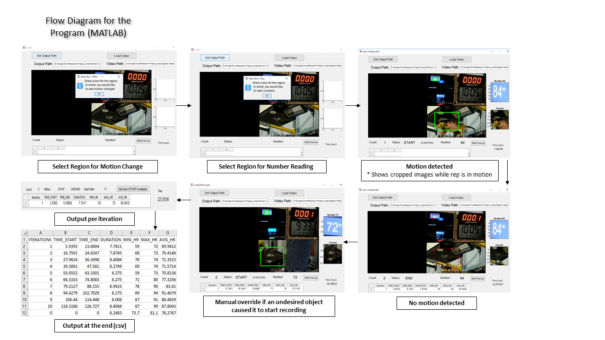
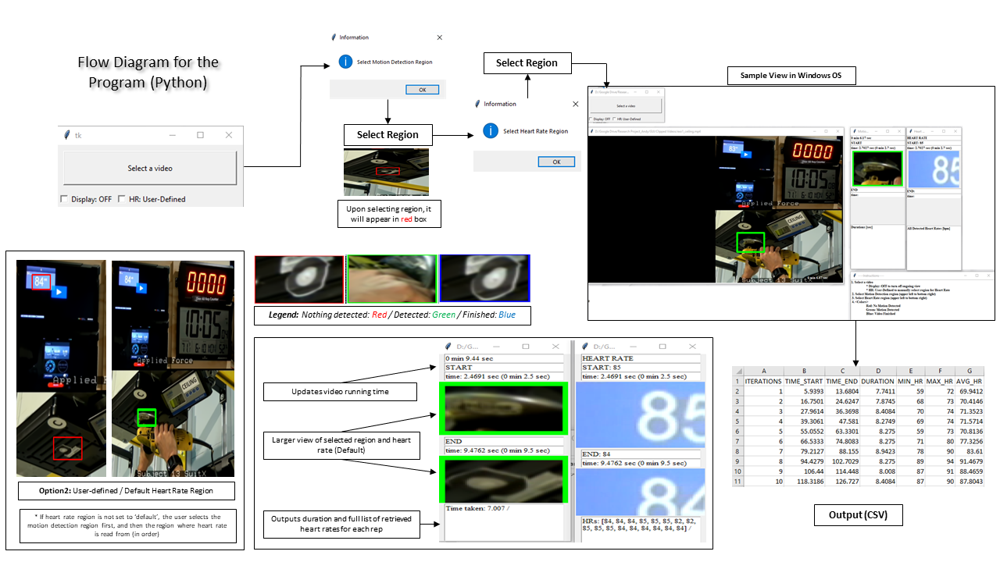

#### Motion Detection (OpenCV), Number Recognition (OCR)
- Program for automated motion detection in a specified ROI (region of interest) and number extraction by reading with OCR (after preprocessing)
- Tools: OpenCV, MATLAB GUIDE (GUI development tool), Computer vision toolbox, Python Tkinter GUI
- Flow diagrams
  
  
